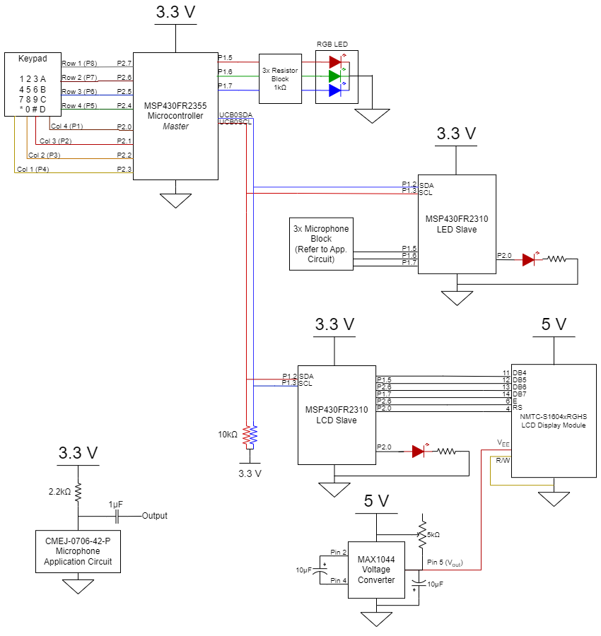
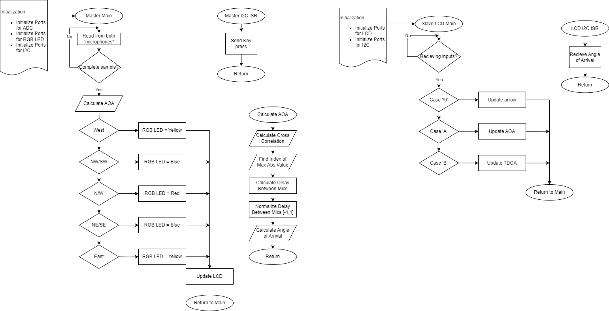

# Final project proposal

- [X] I have reviewed the project guidelines.
- [X] I will be working alone on this project.
- [X] No significant portion of this project will be (or has been) used in other course work.

## Embedded System Description

My system will use three equidistant microphones (CMEJ-0706-42-P) to triangulate the direction a sound comes from in a 2D plane. It will then display the result on the LCD. The three microphones will be inputs connected to an MSP430fr20310 slave. The LCD will be an output connected to a second MSP430fr2310 slave. There will also be an additional keypad input connected to the MSP430fr2355 to set the sensitivity level of the microphones and request information from the microphones. The slaves will communicate to the master using I2C. An RGB LED will be used to show the status of the system.

## Hardware Setup

I will need to order 3 CMEJ-0706-42-P microphones. Other required hardware, which I have, is: 1 MSP430fr2355; 2 MSP430fr2310; 1 Parallax Membrane Keypad; 1 NHD-0216HZ-FSW-FBW-33V3C LCD; 1 RGB LED. The figure shown below is the circuit diagram for this project proposal.

## Software overview

The microphone slave will have code to triangulate the direction of the sound and send coordinates to the master. The master will take the coordinates from the microphone slave and send it to the LCD slave to display the information.

## Testing Procedure

Demo may be difficult if the room is too loud, but I should be able to make a sound and have the LCD display interpretable information that matches with the direction of the sound.

## Prescaler

Desired Prescaler level: 

- [ ] 100%
- [ ] 95% 
- [ ] 90% 
- [X] 85% 
- [ ] 80% 
- [ ] 75% 

### Prescalar requirements 

**Outline how you meet the requirements for your desired prescalar level**

**The inputs to the system will be:**
1.  Parallax Membrane Keypad
2.  CMEJ-0706-42-P microphone #1
3.  CMEJ-0706-42-P microphone #2
4.  CMEJ-0706-42-P microphone #3

**The outputs of the system will be:**
1.  NHD-0216HZ-FSW-FBW-33V3C LCD
2.  RGB LED

**The project objective is**

Display the location a sound is coming from. Especially useful for locating that intemittent beeping somewhere in the house that you can never find.

**The new hardware or software modules are:**
1. The new hardware module are 3x microphones. They are analog voltage outputs, but I will need to build an equation to get coordinates from three different inputs.

The Master will be responsible for:

Setting the sensitivity of the microphones and requesting the system to start up. It will also be responsible for driving the RGB LED.

The Slave(s) will be responsible for:

Determining the location a sound originates from (slave #1) and displaying the direction (slave #2).

### Argument for Desired Prescaler

I meet all the requirements for the 85% prescalar. I have 4 inputs, 2 outputs, use a master/slave topology, my real objective is to locate sounds, and I am implementing on new hardware that is easy to use (besides the fact that triangulating may be difficult, I won't really know until I start).
